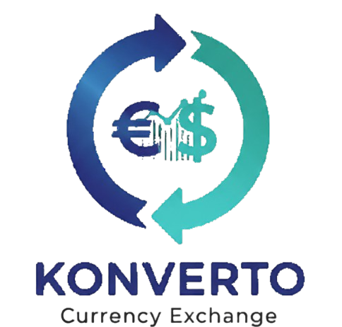

# Konverto - Currency Exchange

<p align="center">
  
</p>

<p align="center">
  Um conversor de moedas responsivo que utiliza taxas de câmbio em tempo real, construído com tecnologias web modernas.
</p>

<p align="center">
  
  
</p>

## 🚀 Demonstração

_Você pode hospedar este projeto em plataformas como GitHub Pages, Vercel ou Netlify e colocar o link aqui._

## ✨ Funcionalidades

- **Cotações em Tempo Real:** Busca as taxas de câmbio mais recentes da [Awesome API](https://docs.awesomeapi.com.br/api-de-moedas) para fornecer conversões precisas.
- **Múltiplas Moedas:** Suporta conversão entre Real Brasileiro (BRL), Dólar Americano (USD), Euro (EUR), Libra Esterlina (GBP) e Bitcoin (BTC).
- **Totalmente Responsivo:** O layout se adapta perfeitamente a qualquer tamanho de tela, desde celulares e tablets até desktops.
- **Interface Interativa:** A interface atualiza dinamicamente as bandeiras, nomes e valores formatados conforme o usuário seleciona diferentes moedas.
- **Animações:** Inclui uma animação no logo e efeitos sutis de `hover` para uma melhor experiência do usuário.

## 📸 Screenshots

|                    Desktop                    |                    Mobile                    |
| :-------------------------------------------: | :------------------------------------------: |
| _Insira aqui um screenshot da versão desktop_ | _Insira aqui um screenshot da versão mobile_ |

## 🛠️ Tecnologias Utilizadas

O projeto foi construído utilizando as seguintes tecnologias:

- **HTML5:** Para a estrutura semântica da página.
- **CSS3:** Para estilização, incluindo:
  - Flexbox para o layout.
  - Media Queries para a responsividade.
  - Keyframes para as animações.
- **JavaScript (ES6+):** Para toda a lógica da aplicação, incluindo:
  - **DOM Manipulation:** Para interagir com os elementos da página.
  - **Async/Await com Fetch API:** Para consumir os dados da API de cotações de forma assíncrona.
  - **Intl.NumberFormat:** Para formatar os valores monetários de acordo com o padrão de cada país.

## API

Este projeto utiliza a **Awesome API** para obter as cotações de moedas em tempo real. É uma API gratuita e de fácil utilização.

- **Endpoint utilizado:** `https://economia.awesomeapi.com.br/json/last/USD-BRL,EUR-BRL,BTC-BRL,GBP-BRL`

## 📂 Estrutura de Arquivos

```
Konverto/
├── assets/
│   ├── background.png
│   ├── bitcoin.png
│   ├── dolar.png
│   ├── euro.png
│   ├── libra.png
│   ├── logo.png
│   ├── real.png
│   └── Vector.png
├── index.html
├── script.js
├── style.css
└── README.md
```

## 🏁 Como Executar

Para executar este projeto localmente, siga os passos abaixo:

1.  **Clone o repositório** (ou simplesmente baixe os arquivos):
    ```sh
    git clone https://github.com/seu-usuario/seu-repositorio.git
    ```
2.  **Navegue até a pasta do projeto:**
    ```sh
    cd Konverto
    ```
3.  **Abra o arquivo `index.html`** no seu navegador de preferência.

E pronto! O conversor de moedas estará funcionando.

---

Feito com ❤️ por **[Seu Nome]**.
